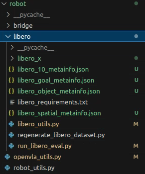
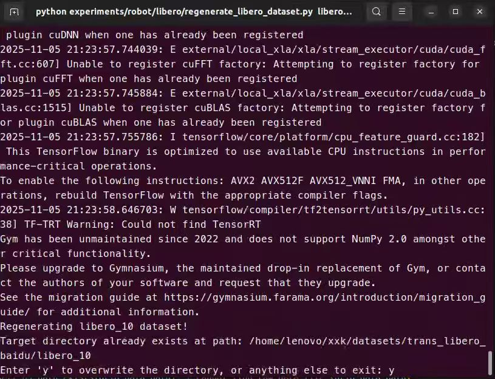
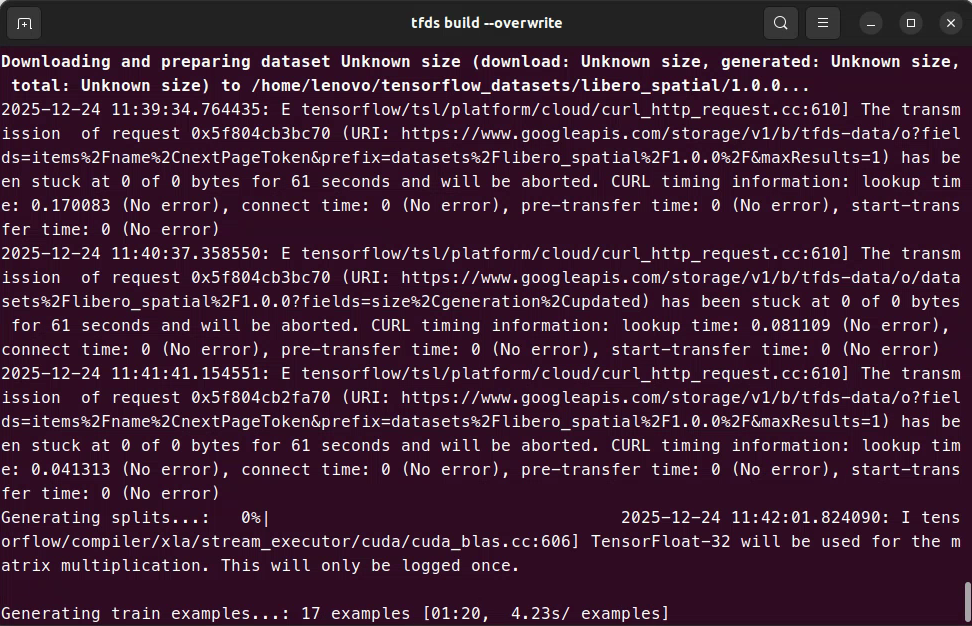
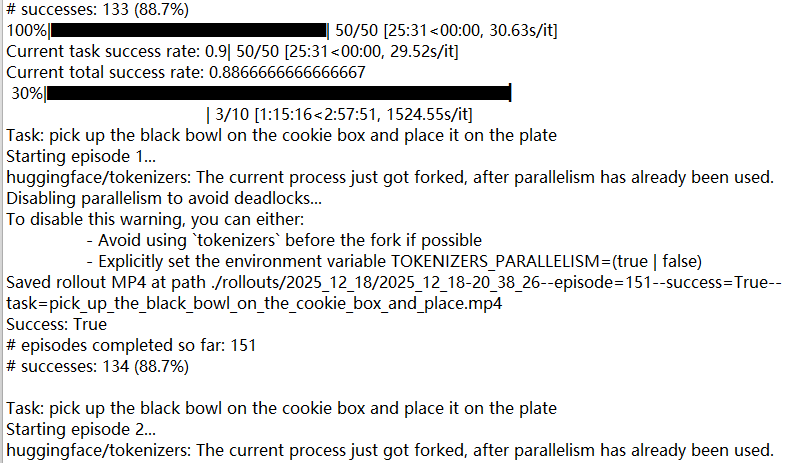

#####这里是个人项目Openvla针对Libero仿真的复现过程，只记录重要节点及流程。
#####

1、

#####搭建openvla所需要的虚拟环境：

#####根据官方的步骤走：（常常最后一步pip install "flash-attn==2.5.5" --no-build-isolation 会有报错，原因是pyproject.toml中的一些库需要自己修改）：下列为官方的流程
"
conda create -n openvla python=3.10 -y
conda activate openvla

# Install PyTorch. Below is a sample command to do this, but you should check the following link
# to find installation instructions that are specific to your compute platform:
# https://pytorch.org/get-started/locally/
conda install pytorch torchvision torchaudio pytorch-cuda=12.4 -c pytorch -c nvidia -y  # UPDATE ME!

# Clone and install the openvla repo
git clone https://github.com/openvla/openvla.git
cd openvla
pip install -e .

# Install Flash Attention 2 for training (https://github.com/Dao-AILab/flash-attention)
#   =>> If you run into difficulty, try `pip cache remove flash_attn` first
pip install packaging ninja
ninja --version; echo $?  # Verify Ninja --> should return exit code "0"
pip install "flash-attn==2.5.5" --no-build-isolation
"
#####现在安装正确流程（openvla和openvla-oft环境都可以通用，一个模型训练前后）的：
"
git clone https://github.com/moojink/openvla-oft.git
cd openvla-oft
修改pyproject.toml中的 
"transformers @git+https://github.com/moojink/openvla-oft.git@v4.40.1openvla-oft"
"diffusers==0.29.2"

修改libero_requirements.txt中的
"numpy==1.26.4"
#####修改保存之后即可进行下一步
conda create -y -n openvla_x python=3.10
conda activate openvla_x

pip install --upgrade pip
pip install torch==2.2.0 torchvision==0.17.0 torchaudio==2.2.0 --index-url https://download.pytorch.org/whl/cu121
pip install -e .
pip install packaging ninja
pip install flash-attn==2.5.5 --no-build-isolation

git clone https://github.com/Lifelong-Robot-Learning/LIBERO.git
这里官方libero安装版本有点老"
conda create -n libero python=3.8.13
conda activate libero
git clone https://github.com/Lifelong-Robot-Learning/LIBERO.git
cd LIBERO
pip install -r requirements.txt
pip install torch==1.11.0+cu113 torchvision==0.12.0+cu113 torchaudio==0.11.0 --extra-index-url https://download.pytorch.org/whl/cu113
"
所以进行修改！！！
"
git clone https://github.com/Lifelong-Robot-Learning/LIBERO.git
cd LIBERO
前面安装完了 这步省略
<!-- pip install torch==2.2.0 torchvision==0.17.0 torchaudio==2.2.0 \
    --index-url https://download.pytorch.org/whl/cu121 -->
pip install -r requirements.txt
"
基本的复现环境就搭建好了，如果还需要mujoco和robosuite库
直接
pip install mujoco robotsuite
"
#####

2、

##### LIBERO 测试
##### 数据准备
##### 首先官方测试在 ../openvla/experiments/robot/libero/下
需要去下载四个任务下特定训练过后的模型权重 
注！！！！原始的https://huggingface.co/openvla/openvla-7b 无法用于libero测试
因为下列四个模型中包含训练过程中产生的对于机械臂运动或模型输出之类的特定数据，原始的在BridgeData上没有这些
所以本人在用原模型测试的时候没有一个成功的抓取
https://huggingface.co/openvla/openvla-7b-finetuned-libero-spatial
https://huggingface.co/openvla/openvla-7b-finetuned-libero-object
https://huggingface.co/openvla/openvla-7b-finetuned-libero-goal
https://huggingface.co/openvla/openvla-7b-finetuned-libero-10
"
这些是我个人已经能正常运行的文件目录

"
先进行数据的转化:
python regenerate_libero_dataset.py \
            --libero_task_suite libero_10 \
            --libero_raw_data_dir /home/lenovo/xxk/datasets/LIBERO_XK_DATA/libero_10 \
            --libero_target_dir /home/lenovo/xxk/datasets/trans_libero_baidu/libero_10

libero_task_suite 可以替换成对应任务 libero-spatial libero-object libero-goal 
libero_raw_data_dir 代表原始的LIBERO四个数据集
libero_target_dir 代表你的输出文件所在

这条命令很容易出现库不对应情况的报错，一步一步修改即可。
本人当时创建环境多已不记得是哪个环境或者步骤来重新生成数据的

##### 运行LIBERO测评
python experiments/robot/libero/run_libero_eval.py \--model_family openvla \--pretrained_checkpoint /home/lenovo/xxk/models/openvla-7b-finetuned-libero-spatial/ \--task_suite_name libero_spatial \--center_crop True

pretrained_checkpoint 即你下载的对应的四个任务下特定训练过后的模型权重的路劲
task_suite_name       要对应pretrained_checkpoint哪个任务下的模型

然后就会有输出结果了
个人的一小节
"

保存的录像结果为下
<video controls src="2025_12_18-20_38_26--episode=20--success=False--task=pick_up_the_black_bowl_between_the_plate_and_the_r.mp4" title="Title"></video> <video controls src="2025_12_18-20_38_26--episode=16--success=True--task=pick_up_the_black_bowl_between_the_plate_and_the_r.mp4" title="Title"></video> <video controls src="2025_12_18-20_38_26--episode=17--success=True--task=pick_up_the_black_bowl_between_the_plate_and_the_r.mp4" title="Title"></video> <video controls src="2025_12_18-20_38_26--episode=18--success=True--task=pick_up_the_black_bowl_between_the_plate_and_the_r.mp4" title="Title"></video> <video controls src="2025_12_18-20_38_26--episode=19--success=True--task=pick_up_the_black_bowl_between_the_plate_and_the_r.mp4" title="Title"></video>
"

#####

3、

##### 将LIBERO数据集转为openvla能微调的finetune.py脚本的RLDS格式的数据集

已做完 明天有空更新~

